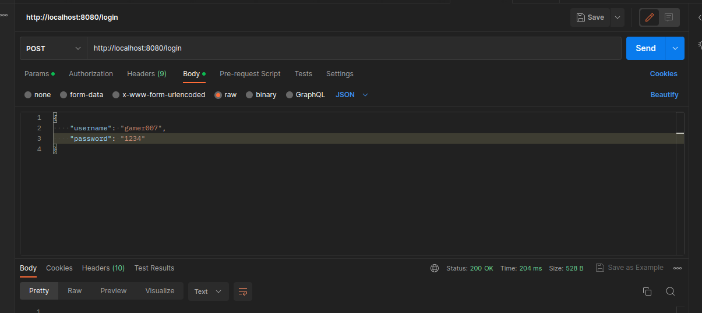

# Fun7

### Description
Fun7 is a backend service for mobile game that is exposing two APIs,
one for game users and one for administration.
Service is not designed to provide user registration, so for demonstration purposes
there are 4 different users already inserted into H2 database at the applications start. 
You should use them to test application.

### Demo users
##### user1
username: user123
password: 12324
##### user2
username: gamer007
password: 12324
##### user3
username: legend2000
password: 12324
##### admin
username: admin
password: admin

By default, no endpoint should be accessible without authorization. To login one must retrieve JWT token.
This can be achieved with this CURL command (or adopt for any other tool):

`curl -v -X POST "http://localhost:8080/login" -H  "accept: application/json" -H  "Content-Type: application/json" -d "{\"username\":\"admin\",\"password\":\"admin\"}"`

#### login in Postman:

Then the copied value from response header should be used as a "Bearer token" in e.g. Postman or pasted in 
"Authorization" in swagger. After that endpoints do not return 403 ( unauthorized) anymore.

### OpenAPI
Open api is accessible on default url: http://localhost:8080/v3/api-docs

Swagger: http://localhost:8080/swagger-ui/index.html
